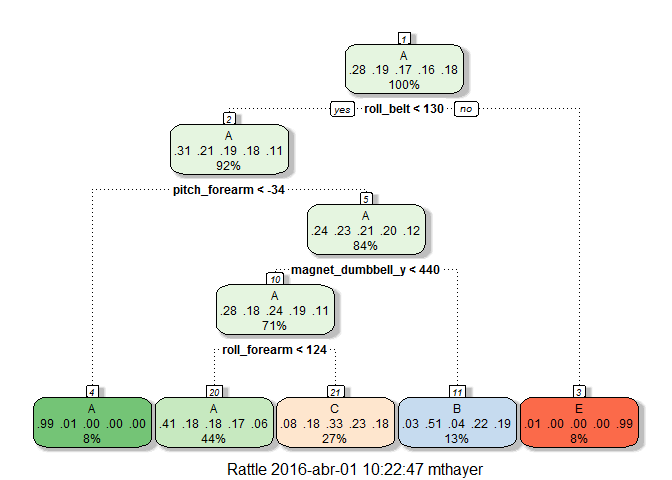

# Predicting movement from mobile devices
MThayer  

## Synopsis

This project pretends to explore and build an accurate predictive model for the manner in which people did the exercise wearing devices. The best fit was found using Random Forest. For validation purposes a 5-folds cross validation was used. 


##Loading and cleaning data

Here we will load the data and do some cleaning, such as managing NA's and looking to the distribution of the prefictors


```r
library(caret); library(dplyr); library(randomForest); library(gbm); library(lubridate); library(glmnet); library(stringr); library(randomForest); library(rpart); library(rattle)

train<-read.csv("pml-training.csv", stringsAsFactors=F)#[1:8000, ]
test<-read.csv("pml-testing.csv", stringsAsFactors=F)
```

## Feature selection

Since there were many potential predictor in this data set, I tried to clean the ones that clearly weren't useful as follows: 
* Delete the X predictor because it's an ID
* Convert to numerical all the columns that look like numerical
* Deal with NA values (converting to -1 or a number not in the scale of the predictor in the case it contains negatives)
* Remove duplicated features. I found that max_yaw_belt and min_yaw_belt are equals; max_yaw_dumbbell and min_yaw_dumbbell are equals; and max_yaw_forearm and min_yaw_forearm are equals.
* Remove features with zero variance using the "nearZeroVar function""


```r
### Removing the id
testX<-test$X
train$X=NULL; test$X<-NULL
train$cvtd_timestamp=NULL; test$cvtd_timestamp<-NULL

train[is.na(train)]<- -1
test[is.na(test)]<- -1

### Convert to numeric where it seemed to be a number
for(c in names(dplyr::select(train, -classe, -user_name))) {
   if(!is.numeric(train[,c])){
       #c="kurtosis_yaw_dumbbell"
       train[,c]=as.numeric(train[,c])
       test[,c]=as.numeric(test[,c])
       train[is.na(train[,c]),c]<-ifelse(is.na(min(train[,c])), 0, min(train[,c]))-1
       test[is.na(test[,c]),c]<-ifelse(is.na(min(train[,c])), 0, min(train[,c]))-1
   }
}

### The test and train set don't have the same columns. So, we use only the one that match
features<-intersect(names(train), names(test))
classe<-train$classe

dummies = dummyVars("~.",data=rbind(train[,features]), fullRank=T)
train=as.data.frame(predict(dummies, newdata=train))
test=as.data.frame(predict(dummies, newdata=test))

#Look for zero variance features and remove them
nsv<-nearZeroVar(train, saveMetrics=TRUE)

train<-train[,!nsv$zeroVar]
test<-test[,!nsv$zeroVar]

##### Removing identical features
features_pair <- combn(colnames(train), 2, simplify = F)
toRemove <- c()
for(pair in features_pair) {
  f1 <- pair[1]
  f2 <- pair[2]
  
  if (!(f1 %in% toRemove) & !(f2 %in% toRemove)) {
    if (all(train[,f1] == train[,f2])) {
      cat(f1, "and", f2, "are equals.\n")
      toRemove <- c(toRemove, f2)
    }
  }
}
```

```
## max_yaw_belt and min_yaw_belt are equals.
## max_yaw_dumbbell and min_yaw_dumbbell are equals.
## max_yaw_forearm and min_yaw_forearm are equals.
```

```r
features <- setdiff(colnames(train), toRemove)
train<- train[,features]
test<- test[,features]
```

##Modeling

I have built the models using the features selected in the previous section. The strategy here consisted on splitting our train set in 5-folds, and generating one prediction for each out of fold set. I tested several models such as random forest, gbm, lasso and cart trees, but finally the one that performed the best was Random Forest. I applied PCA with a high threshold (99%). Even with this threshold the amount of features were reduced by about 50%. 

Lets see the code that creates the out of fold predictions.
Note: I know that caret has a built-in functionality for doing k-folds cross validation, but I prefered to code a similar thing by myself. 


```r
set.seed(123)

### Predictions repository for train
n.preds <- 1
preds <- matrix(0, nrow = nrow(train), ncol = n.preds)
predsTest <- matrix(0, nrow = nrow(test), ncol = n.preds)

### 5 Fold using createFolds
n.fold <- 5
folds<-createFolds(y=as.factor(classe), k=n.fold, list=TRUE, returnTrain = FALSE)


for (fold.id in 1:n.fold) {
    train.id <- unlist(folds[-fold.id])
    valid.id <- unlist(folds[fold.id])
    
    # Applying PCA to reduce dimensionality
    preProc<-preProcess(train[train.id,], method=c("pca"), thresh = .99)
    trainPC<-predict(preProc, train[train.id,])
    validPC<-predict(preProc, train[valid.id,])
    testPC<-predict(preProc, test)
  
    trainPC$classe<-classe[train.id]
    
    #rf model #####################################
    model.name="Random Forest"
    
    fitRf<-randomForest(as.factor(classe)~., data=trainPC, ntree=250)

    preds[valid.id, 1] <- predict(fitRf, validPC)
    predsTest[,1] <- as.numeric((predsTest[,1])) + as.numeric(predict(fitRf, testPC))
    
    cat("\n Accuracy of", model.name, "fold:", fold.id, "->", sum(diag(table(classe[valid.id], preds[valid.id, 1])))/sum(table(classe[valid.id], preds[valid.id, 1])))
    
}
```

```
## 
##  Accuracy of Random Forest fold: 1 -> 0.9745223
##  Accuracy of Random Forest fold: 2 -> 0.9768094
##  Accuracy of Random Forest fold: 3 -> 0.9778344
##  Accuracy of Random Forest fold: 4 -> 0.9745223
##  Accuracy of Random Forest fold: 5 -> 0.9747642
```

### Prediction Error
After the random forest model was trained, we see that the prediction error is quite low for this data set. Just about 2.5%. In order to generate the predictions on our test set a new model will be trained using the same parameters as before


```r
# Applying PCA to reduce dimensionality
preProc<-preProcess(train, method=c("pca"), thresh = .99)
trainPC<-predict(preProc, train)
testPC<-predict(preProc, test)

fitRf<-randomForest(as.factor(classe)~., data=trainPC, ntree=250)
finalPreds <- predict(fitRf, testPC)
```

Finally, lest see our predictions on the 20 rows test set

```r
print(data.frame( pred=finalPreds), 20)
```

```
##    pred
## 1     B
## 2     A
## 3     C
## 4     A
## 5     A
## 6     E
## 7     D
## 8     B
## 9     A
## 10    A
## 11    B
## 12    C
## 13    B
## 14    A
## 15    E
## 16    E
## 17    A
## 18    B
## 19    B
## 20    B
```


##Apendix


```r
fitCart<-train(as.factor(classe)~., method="rpart", data=train)
fancyRpartPlot(fitCart$finalModel)
```

 


